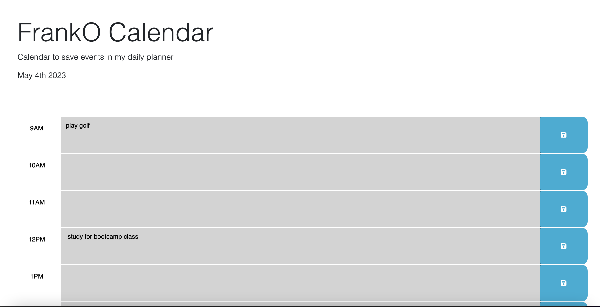

# FrankO-Calender
Making calendar that allows a user to save events for each hour of the day. This app will run in the browser and feature dynamically updated HTML and CSS powered by jQuery.This web App will run in browser,and will feature dynamically updated HTML and CSS powered by Javascript code. It will have a clean, published, and responsive user interface.This calendar will help the client schedule meetings to help them with their busy schedule.They can use this app to help them manage their time effectively.

In this project, I am using starter code that uses Day.js library to work with date and time. My project repo is called FrankO-Calender and under this folder I have an assets folder, index.html and script.js and the README.md(this file) on the same level. Under the assets folder, I have 2 more sub folders called css and images and under the css folder, style.css is in there. Inside the images folder, there is 1 picture file for the example calendar app.

URL: https://franko88bit.github.io/FrankO-Calender/

Screenshot of FrankO Calendar:

